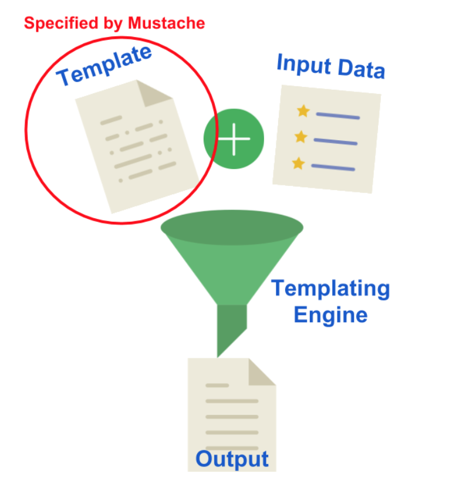

# Mustache:

Mustache is a logic-less template syntax. It can be used for HTML, config files, source code — anything. It works by expanding tags in a template using values provided in a hash or object.


It is often referred to as “logic-less” because there are no if statements, else clauses, or for loops. Instead, there are only tags. Some tags are replaced with a value, some nothing, and others a series of values.
mustache.js is an implementation of the mustache template system in JavaScript. It is often considered the base for JavaScript templating. And, since mustache supports various languages, we don’t need a separate templating system on the server side.


Mustache.render(“Hello, {{name}}”, { name: “Sherlynn” });
// returns: Hello, Sherlynn

In the above, we see two braces around {{ name }}. This is Mustache syntax to show that it is a placeholder. When Mustache compiles this, it will look for the ‘name’ property in the object we pass in, and replace {{ name }} with the actual value, e,g, “Sherlynn”.


A confusion that I have initially was that Mustache is a templating engine. However, after some googling, I’ve come to learn that Mustache is NOT a templating engine. Mustache is a specification for a templating language. In general, we would write templates according to the Mustache specification, and it can then be compiled by a templating engine to be rendered to create an output.




> Mustach template example 

```<h4>Product Info: {{name}}</h4>

<ul>
  <li>Product: {{name}}</li>
  <li>Colour: {{colour}}</li>
  <li>Price: ${{price}}</li>
</ul>
```

# Flex 

The flex property is a shorthand property for:

flex-grow
flex-shrink
flex-basis
The flex property sets the flexible length on flexible items.

Note: If the element is not a flexible item, the flex property has no effect.

> display

This defines a flex container; inline or block depending on the given value. It enables a flex context for all its direct children.

``` 
.container {
  display: flex; /* or inline-flex */
}
```
Note that CSS columns have no effect on a flex container.


> flex-direction
the four possible values of flex-direction being shown: top to bottom, bottom to top, right to left, and left to right

This establishes the main-axis, thus defining the direction flex items are placed in the flex container. Flexbox is (aside from optional wrapping) a single-direction layout concept. Think of flex items as primarily laying out either in horizontal rows or vertical columns.

```
.container {
  flex-direction: row | row-reverse | column | column-reverse;
}
``
row (default): left to right in ltr; right to left in rtl
row-reverse: right to left in ltr; left to right in rtl
column: same as row but top to bottom
column-reverse: same as row-reverse but bottom to top